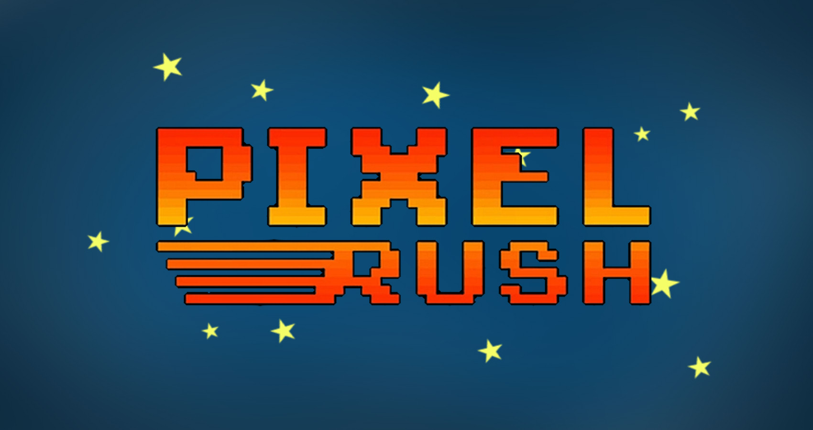
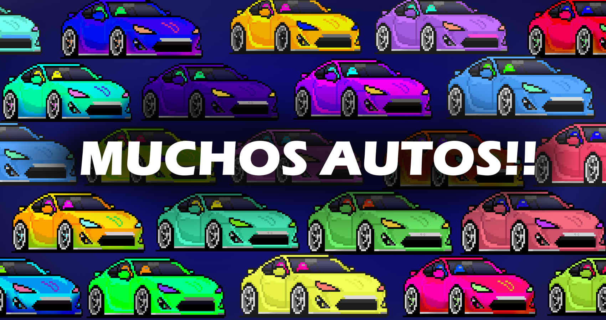
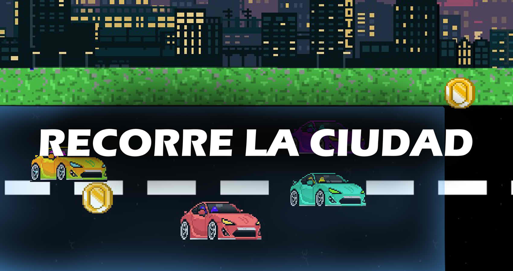

# Pixel Rush
### Proyecto: Juego de carreras en Pygame
--------------------------------------------------------------

### Alumno:
* Josue Damacio
---------------------------------------------------------------
## Objetivo:
Al jugar, deberás recoger todas las monedas del suelo en el menor tiempo posible para quedar en las primeras posiciones del SCOREBOARD del menú, pero el camino estará lleno de autos de distintos colores y diseños que deberás esquivar para no perder monedas ni tiempo.

y es que al chocar, tu personaje se detendrá por un tiempo, pero el reloj no! Y todo el tiempo que pase se restará a tu puntaje final. 

Otro problema que hay es el aceite que los autos dejan en el piso, al pisarlo, perderás parcialmente el control y se inverirá tu movimiento y tambien se aumentará tu velocidad hasta que pises otro charco, puede ser tambien una ventaja si sabes usarlo a tu favor para esquivar mas deprisa o recoger mas monedas, todo queda en tus manos...

------------------------------------------

## CODIGO DEL JUEGO:

### Jugador:

el personaje aparece siempre en un lugar pasado por parametros dentro del archivo "parametros.py", ahí es donde se instancia el bojeto de la clase "Personaje", que es usada para crear un player con los siguientes atributos:
~~~
class Personaje:
    def __init__(self, ancho,alto,skin, x, y,vidas_totales):
        self.path = skin
        self.imagen = getSuperficie(self.path, ancho, alto)
        self.rect_img = pygame.Rect(x, y, 300, 150)
        self.rect_hitbox = pygame.Rect(x + 9, y + 20, 120, 48)
        self.control_movimiento = 1
        self.mancha_aceite = 1
        self.invulnerable = False
        self.vida = vidas_totales
        self.nombre = ""
        self.tiempo_jugado = 0
        self.monedas = 0
        self.final_score = 0
~~~
dichos atributos sirven para darle tamaño y posicion al jugador, interactuar con la velocidad de otros objetos (como el fondo o las monedas en el piso que se detienen al chocar) o reaccionar ante colisiones (como lo hace con el aceite). Además de esto sirve para guardar información que posteriormente se subirá a la base de datos al guardar tu partida

### Elementos en pista:

Hay diferentes elementos en el suelo como son las monedas, vidas, manchas de aceite o los autos. Estos ademas de tener una velocidad de movimineto, aportan dsitintos efectos al jugador como sumar vidas o cambiar el movimineto del mismo, además de tener un rango de aparecion diferente, aunque se intentó sintentizar en una clase padre con herencia, pero no pude

~~~
class Moneda :
    def __init__(self, ancho, alto, path,numero_de_objetos, velocidad):

        self.ancho = ancho
        self.alto = alto
        self.img_path = path
        self.imagen = getSuperficie(path, ancho, alto)
        self.cantidad = numero_de_objetos
        self.movimiento = velocidad
        self.img_dimensiones = self.imagen.get_rect()
        self.img_dimensiones.x = random.randrange(1700,4100,100)
        self.img_dimensiones.y = random.randrange(520,850,50)
        self.rect_hitbox = self.img_dimensiones.copy()
        self.rect_hitbox.x += 8
        self.rect_hitbox.y += 8
        self.rect_hitbox.width -= 20
        self.rect_hitbox.height -= 20
~~~

### Fondo y botones:

el fondo está hecho dentro del archivo "fondo_obj.py" y los botones, son objetos hijos de esta clase "Imagen", la diferencia de los botones es que posee una hitbox que interactua con el click del mouse

~~~
import pygame
from imagenes_en_pantalla import Imagen

class Boton(Imagen):
    def __init__(self, x, y, ancho, alto, path) -> None:
        #esta es una clase heredera de Imagen, pero le agrega un rectangulo
        #que interactua con el click del mouse
        super().__init__(x, y, ancho, alto, path)

        self.rectangulo = pygame.Rect(x, y, ancho, alto)

    def clickeado(self,lista_click,mostrar,numero_anterior,numero_actual):
        if lista_click[0] > self.rectangulo[0] and lista_click[0] < (self.rectangulo[0]+self.rectangulo[2]):
            if lista_click[1] > self.rectangulo[1] and lista_click[1] < (self.rectangulo[1]+self.rectangulo[3]):
                mostrar = numero_actual
                return mostrar
        else:
            mostrar = numero_anterior
            return mostrar
~~~

hay más funcionalidades, codigo y archivos que no me dio tiempo de documentar, pero están presentes en el juego :)

### video del juego:

- [>Aqui<](https://youtu.be/ssbtzt01SbQ)
